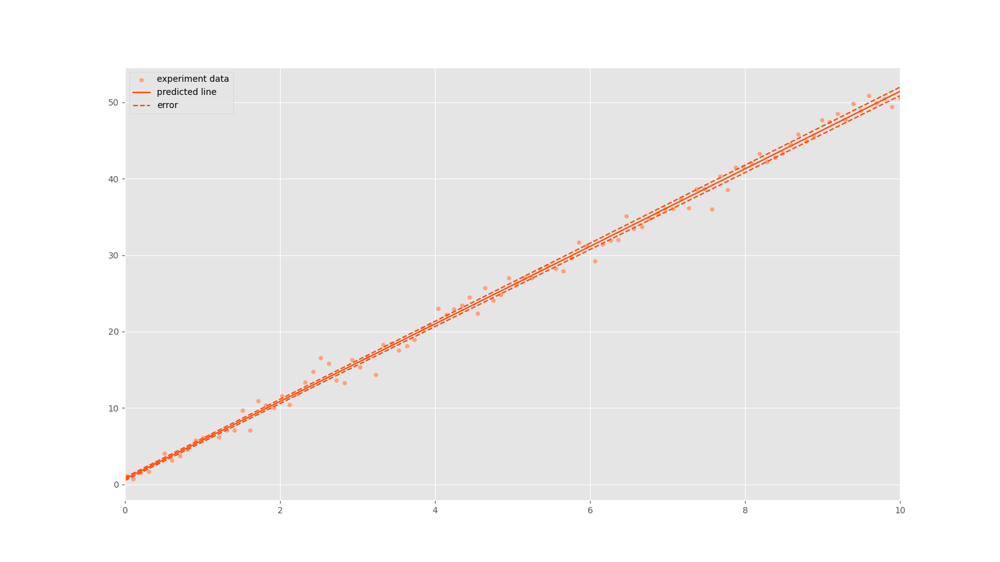

# Домашнее Задание 1: Метод Наименьших Квадратов для линейных функций

## Предварительные шаги

Прежде чем начать выполнение задания, вам необходимо настроить среду:

- перейдите в директорию, содержащую данные о вашем репозитории;

- создайте виртуальное окружение (virtual environment); этот шаг необходим, чтобы установить сторонние библиотеки, при этом не оказывая эффекта на глобальное виртуальное окружение; чтобы создать виртуальное окружение выполните следующую команду в командной строке:
    ```console
    python -m venv venv
    ```

    после выполнения этой команды в текущей директории должна появится папка `venv`, в которой содержится вся информация о виртуальном окружении;

- теперь вам необходимо активировать виртуальное окружение, чтобы все манипуляции с пакетным менеджером осуществлялись в рамках изолированной среды; для активации необходимо запустить специальный скрипт, хранящийся в папке `venv`; запуск скрипта выглядит следующим образом:

    *Windows*:
    ```console
    .\venv\Scripts\activate
    ```

    *Unix-подобные ОС*:
    ```
    source venv/bin/activate
    ```
- после активации виртуального окружения установим необходимые зависимости; список зависимостей хранится в файле `homeworks/hw1/requirements.txt`; для установки выполним следующую команду:

    ```console
    pip install -r homeworks/hw1/requirements.txt
    ```

## Описание задания

### Теоретическая справка

Метод наименьших квадратов (МНК) - математический метод оценки некоторой зависимости путем минимизации функционала качества: суммы квадратов отклонений теоретических значений от экспериментальных данных. Оценка параметров линейной зависимости является простейшей задачей на применение МНК.  

Формальная постановка задачи описывается следующим образом:

Пусть у нас имеется некоторая независимая величина $x$, принимающая значения из множества $X \subset \mathbb{R}$, и величина $y$, принимающая значения из множества $Y \subset \mathbb{R}$. Мы точно не знаем, как величина $y$ зависит от величины $x$, но можем предполжить, что между ними существует линейная связь: $f: x \rightarrow y$, $f(x) = ax + b$. В общем случае, эта связь неизвеста, но имеется некоторая выборка - счетное множество пар вида: $\{(x_i, y_i)\}, i = \overline{1, n}, x_i \in X, y_i \in Y$ - экспериментально полученные наблюдения. Тогда для каждого наблюдения можно определить ошибку регрессии $\varepsilon_i = y_i - f(x_i) = y_i - a \cdot x_i - b$. Наша задача - подобрать оптимальные коэффициенты $a$ и $b$, которые минимизируют сумму квадратов ошибок $\varepsilon_i$.

Т.е. восстановление линейной зависимости с помощью МНК - это решение следующей оптимизационной задачи:

$$\sum\limits_{i=1}^{n} {(y_i - a \cdot x_i - b)^2} \rightarrow min_{a, b}$$

Данная задача имеет аналитическое решение, которое вы без труда сможете вывести самостоятельно, освоив программу Математического Анализа за второй семестр (для получения решения необходимы понятия функции многих переменных и частной производной). Само решение выглядит следующим образом:

$$a = \dfrac{ \langle xy \rangle -  \langle x \rangle \langle y \rangle}{ \langle {x}^2 \rangle - {\langle x \rangle }^2}$$

$$b = \langle y \rangle - a \langle x \rangle$$

В данных уравнения символ $\langle\cdots\rangle$ обозначает среднее значение по выборке, т.е. $\langle x \rangle = \dfrac{1}{n}\sum\limits_{i=1}^{n}{x_i}$.

Помимо оценок коэффициентов линейной зависимости также вычисляют значения оценок их дисперсий, используемые для определения среднеквадратичных отклонений. Оценки дисперсий вычисляются по следующим формулам:

$$\sigma_y^2 = \dfrac{1}{n - 2}  \sum\limits_{i=1}^{n}{(y_i - ax_i - b)^2}$$

$$\sigma_a^2 = \dfrac{\sigma_y^2}{n(\langle {x}^2 \rangle - {\langle x \rangle}^2)}$$

$$\sigma_b^2 = \dfrac{\sigma_y^2 \langle {x}^2 \rangle}{n(\langle {x}^2 \rangle - {\langle x \rangle}^2)}$$


$\sigma_y^2$ - оценка дисперсии зависимой величины (истинная дисперсия шума нам никогда неизвестна); в знаменателе расположено выражение $n-2$, необходимое для выполнения свойства несмещённости этой оценки (о несмещённости оценки и других её свойствах вы узнаете в курсе Математической Статистики в пятом семестре). Из этого следует, что $n \geq 3$, т.е. для вычисления оценки требуется как минимум 3 эксперименальные точки. 

### Техническое задание

Ваша задача - реализация метода наименьших квадратов используя **только встроенные** средства языка Python (сторонними библиотеками, типа NumPy, пользоваться запрещено).

Что вам нужно сделать:
- Реализовать функцию `get_lsm_description()`; Функция принимает на вход три аргумента: **abscissa** - список чисел с плавающей точкой - измерения независимой величины,  **ordinates** - список чисел с плавающей точкой - измерения зависимой величины, **mismatch_strategy** - значение из перечисления `MismatchStrategies` - стратегия по обработке несовпадения длин входных списков; Функция позволяет получить описание МНК и возвращает структуру типа `LSMDescription`, содержащую 4 поля: коэффициенты наклона **incline** и смещения **shift**, среднеквадратичные отклонения **$\sigma_a$**, **$\sigma_b$**, помимо этого, функция должна обладать следующей логикой:
    - Перед началом вычислений необходимо произвести валидацию переданных списков: проверить, что переданные значения - списки; в случае, если это возможно, попытаться привести полученные значения к типу list, если это невозможно - возбудить исключение `TypeError`; проверить, что все элементы списка - действительные числа (вам понадобится абстрактный класс `Real`), если это не так, возбудить исключение типа `ValueError`; проверить, что длина списка больше 2, если это не так - возбудить исключение типа `ValueError`;  
    - Если длины списков не совпадают необходимо обработать несоответствие, пользуясь одной из стратегий обработки, задаваемой аргументом **mismatch_strategy**; Если mismatch_strategy == MismatchStrategies.FALL, необходимо возбудить исключение типа `RuntimeError`; Если mismatch_strategy == MismatchStrategies.CUT, необходимо привести списки к единой длине, равной минимальной из двух длин переданных аргументов; Если значение mismatch_strategy отлично от перечисленных - необходимо возбудить исключение типа `ValueError`;
    - Будет плюсом, если по ходу выполнения функции вы будете логировать определенные этапы выполнения с помощью объекта `EventLogger`;

- Реализовать функцию `get_lsm_lines()`; Функция принимает на вход три аргумента: **abscissa** - список чисел с плавающей точкой - измерения независимой величины,  **ordinates** - список чисел с плавающей точкой - измерения зависимой величины, **lsm_description** - необязательный аргумент, None или объект типа `LSMDescription`; Функция позволяет получить значение типа `LSMLines` - специальная структура для описания значений функций, полученных в результате использования МНК, в экспериментальных точках, обладает пятью полями: **abscissa** - список чисел с плавающей точкой - измерения независимой величины,  **ordinates** - список чисел с плавающей точкой - измерения зависимой величины, **line_predicted** - список чисел с плавающей точкой - значения функции $f(x) = ax + b$ на точках из массива **abscissa**, **line_above** - список чисел с плавающей точкой - значения функции $f(x) = (a + \sigma_a)x + b + \sigma_b$ на точках из массива **abscissa**, **line_under** - список чисел с плавающей точкой - значения функции $f(x) = (a - \sigma_a)x + b - \sigma_b$ на точках из массива **abscissa**; Функция должна обладать следующей логикой:
    - Перед началом вычисления значений функций, необходимо проверить значение аргумента **lsm_description**; Если его значение - None, необходимо вычислить описание МНК - значение типа `LSMDescription`; Если тип значения **lsm_description** отличен от `LSMDescription` необходимо вызвать исключение типа `TypeError`; Иначе можно переходить к вычислениям;  
    - Будет плюсом, если по ходу выполнения функции вы будете логировать определенные этапы выполнения с помощью объекта `EventLogger`; 

- Реализовать функцию `get_report()`, с помощью которой можно получить строку - отчет о расчитанном МНК; Функция обладает двумя параметрами: обязательный параметр **lsm_description** - объект типа `LSMDescription`, с которым вы уже знакомы, и **path** - необязательный параметр, строка - путь к файлу, в который можно сохранить отчет; Если параметр path заполнен, происходит сохранение вашего отчета в этот файл (вам будет полезна функция `open()`, возможно, будет полезна функция `os.path.exists()`); Функция возвращает строку - отчет в следующем формате:
    ```console
    ========================================LSM computing result========================================

    [INFO]: incline: 5.068;
    [INFO]: shift: 0.730;
    [INFO]: incline error: 0.035;
    [INFO]: shift error: 0.203;

    ====================================================================================================
    ```

Помимо этого в проекте есть функции с префиксом _, это служебные функции, которые могут оказаться полезными для поддержания понятной структуры вашей работы.

### Структура проекта

*Структура проекта:*
```console
homeworks/hw1/
├───lsm_project
│   ├───event_logger
│   │   ├───__init__.py
│   │   └───event_logger.py
│   ├───lsm
│   │   ├───__init__.py
│   │   ├───enumerations.py
│   │   ├───functions.py
│   │   └───models.py
│   └───visualization.py
├───main.py
├───tests
│   └...
├───description.md
├───measurments.json
└───requirements.txt
```

В папке `lsm_project/` лежит специальный класс для логирования `EventLogger`, изменять его не надо. Папка `lsm/` содержит полезные перечисления в модуле `enumerations` и структуры данных в модуле `models`. Вас интересует файл `functions`, в котором лежат заготовки функций, необходимых для реализации МНК.

Для самопроверки вы можете, перейдя в директорию hw1/, запустить скрипт main.py для проверки работоспособности вашего кода. В файле visualize.py лежат функции для визуализации полученной зависимости. В результате выполнения main.py в директории hw1/ должен появится png-файл следующего содержания:



## Оценивание решения

Первичная оценка:

- Оформление: задание считается оформленным правильно, если утилита `flake8` не выдает никаких ошибок; Вы можете самостоятельно проверить правильность оформления, установив `flake8` командой:
    ```console
    pip install flake8
    ``` 

    после чего запустив его, командой:
    ```console
    flake8 path/to/hw1
    ```

    Каждая ошибка, обнаруженная линтером, будет наказываться снижением итоговой оценки за оформление на 0.5 балла; Максимальный балл - 10;

- Корректность: задание считается правильно выполненным, если полученное решение проходит все юнит-тесты; Вы можете самостоятельно проверить корректность решения с помощью утилиты `pytest`:

    ```console
    pytest path/to/hw1_folder
    ```

    Всего вам предложено реализовать 3 функций. Функция считается правильной, если ни один тест из набора тестов для данной функции не заканчивается со статусом, отличным от `PASSED`. В этом случае, вы получаете 1 балл, иначе - 0. Итоговая оценка за правильность: $grade = 10 \times \frac{1}{3}\sum\limits_{i = 1}^{3}{grade_i}$;

- Первичная оценка вычислятеся по формула: $grade_{init} = 0.3 \times grade_{beauty} + 0.7 \times grade_{correct}$;

Чтобы получить итоговую оценку, вам необходимо защитить результат первичного оценивания во время устной сдачи семинаристу. Помимо этого семинаристом будет оцениваться структура вашего проекта. Семирист может понизить или аннулировать первичную оценку, если посчитает, что решение неэффективно или списано.
