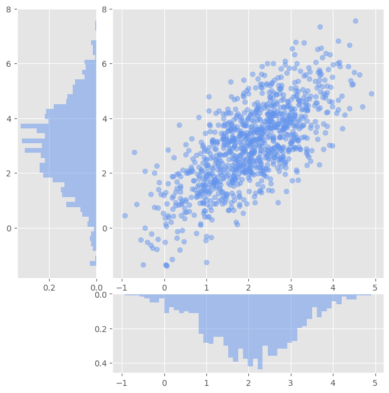

# Домашнее задание 2: Визуализация и немного анализа

В прошлой домашней работе мы начали создавать свой фреймворк для анализа данных. У нас уже есть алгоритмы классификации и регрессии, утилита для разбиение данных на обучающую и тестовую часть, а также метрики качества. В этой домашней работе мы дополним наш фреймворк парой функций для визуализаций и анализа данных.

## Анализ входных данных

В начале решения любой задачи из сферы науки о данных, необходимо оценить распределения данных, понять, какие данные являются приемлемыми для дальнейших расчетов, а какие - аномальными, выбросами, которые испортят работу нашего алгоритма. Для визуализации распределений входных данных реализуем следующую функцию:

```python
def visualize_distribution(
    axis: plt.Axes,
    data: np.ndarray,
    diagram_type: Any,
    path_to_save: str = "",
) -> None:
    ...
```

Данная функция принимает на вход координатные оси `axis` и численное описание наших данных `data`, причем данные могут быть описаны, как одним числом, так и вектором действительных чисел. Аргумент `diagram_type` задает тип используемой для визуализации диаграммы. Доступны 3 варианта: `violin`, `hist`, `boxplot`. `path_to_save` - путь к файлу, в который необходимо сохранить полученную картинку. Если путь к файлу - пустая строка, не сохранять картинку. Если файл с указанным именем существует, возбудить `warning` и сохранить картинку. 

**Важно:** возбуждать нужно именно предупреждение, а не исключение. Мы хотим лишь уведомить пользователя о возможных плачевных последствиях его необдуманных действий, а не положить программу.

Поскольку элементами массива данных могут быть как действительные числа, так и вектора, функция должна строить визуализации с опорой на переданные данные:

- В случае, когда массив `data` - одномерный, мы просто строим требуемый тип диаграммы на основе переданных данных;
- В случае, если массив `data` - двумерный, и вторая размерность равна двум - мы строим визуализацию следующего типа: в центральную часть визуализации включена диаграмма рассеяния данных, вертикальная часть визуализации - распределение ординат, горизонтальная - распределение абсцисс. Итоговая визуализация выглядит следующим образом:


- Задача со звездочкой: подумать, как можно было бы отрисовать данные большей размерности, и реализовать придуманный вариант.

Несмотря на всю свою полезность, с помощью визуального анализа бывает затруднительно фильтровать сами данные в коде, а это может быть необходимо. Так, например, по результатам построения распределения, мы можем захотеть исключить все выбросы из наших данных, чтобы избежать вычислительных проблем. Реализуем для этих целей следующую функцию:

```python
def get_boxplot_outliers(
    data: np.ndarray,
    key: Callable[[Any], Any],
) -> np.ndarray:
    ...
```

Данная функция должна реализовывать следующий алгоритм:
- Сортировать переданные данные в порядке возрастания;
- Определить 1 и 3 квартили: $q_1$ = `data_sorted[size * 0.25]`, $q_3$ = `data_sorted[size * 0.75]`.;
- Вычислить $\epsilon = (q_3 - q_1) \times 1.5$;
- Вычислить индексы элементов, лежащих вне $[q_1 - \epsilon, q_3 + \epsilon]$;
- Вернуть вычисленные индексы - индексы выбросов.

Подробнее про boxplot [тут](https://ru.wikipedia.org/wiki/%D0%AF%D1%89%D0%B8%D0%BA_%D1%81_%D1%83%D1%81%D0%B0%D0%BC%D0%B8).

Обратите внимание, что указанный отрезок в общем случае является n-мерной прямоугольной окрестостью.

На вход функция принимает входные данные `data` и вызываемый объект `key` - функцию, используемую для сортировки (аналогия с встроенной функцией `sorted`). Выход функции - массив индексов выбросов.

## Визуализация результатов

Итак, на этом этапе мы умеем просматривать и фильтровать входные данные, обрабатывать их простыми алгоритмами машинного обучения и оценивать качество результатов с помощью метрик. Не хватает построения красивых визуализаций с графиками результатов, чтобы мы могли использовать полученные визуализации в отчетных материалах.

### Классификация

Реализуйте функцию для визуализации данных классификации. Предусмотрите возможность визуализации более чем 2 классов. Предусмотрите возможность настройки цветов визуализации переданных классов. Механизм работы с цветами должен повторять механизм работы с цветами в фунециях Matplotlib:
- Если количество переданных цветов больше, чем количество классов, используем первые n цветов, где n - количество классов;
- Если количество переданных цветов меньше количества классов - циклически перебираем цвета;

### Регрессия

Реализуйте функцию для визуализации регрессии. Визуализировать необходимо саму облако точек - входные данные, рассчитанный тренд, а также, если были переданы соответствующие данные - коридор ошибок. Коридор ошибок можно визуализировать как пунктирными линиями одного цвета, так и полупрозрачной заливкой.

## Задача

Реализуйте описанный функционад.

## Требования

- Срок сдачи работы (срок создания пулл-реквеста) - 28.04.24;
- Реализованы все описанные функции;
- Поведение реализуемых функций соответствует описанию;
- Все функции визуализации имеют параметр `save_path` для сохранения результата в виде изображения;
- Реализованный функционал встроен в структуру проекта из первой домашней работы;
- Реализованный функционал проходит проверку flake8. 
