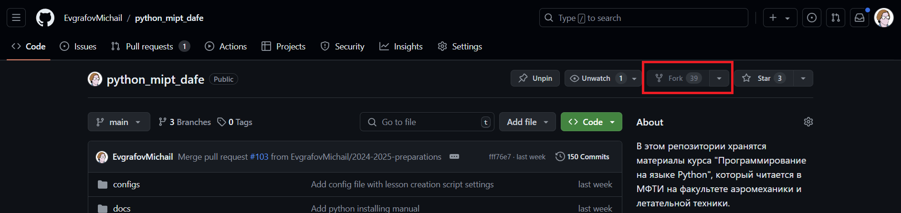

# Введение в Git. Практическое занятие.

## Установка Git

Прежде, чем начинать работать с git, необходимо установить git на ваше устройство:

- [Установка git на Windows](https://git-scm.com/download/win)
- [Установка git на MacOS](https://git-scm.com/download/mac)
- [Установка git на Linux](https://git-scm.com/download/linux)

После завершения установки в командной строке выполните команду:
```console
git --version
```

Установка прошла успешно, если в результате выполнения команды вы получили сообщение похожего формата:
```console
git version 2.42.0.windows.2
```

## Настройка Git

Прежде чем начинать работу с git вам необходимо сообщить системе контроля версий сведения о себе: имя пользователя и адрес электронной почты. Это важный шаг, поскольку эти данные будут включаться в каждый коммит.

Для настройки имени пользователя и адреса электронной почты выполните следующие команды:
```console
git config --global user.name "Your Username"
git config --global user.email "youremail@mail.ru"
```

Команда `git config` используется для изменений пользовательских настроек. Флаг `--global` показывает, что вы изменяете системные настройки, которые будут применяться ко всем создаваемым репозиториям. Если вы захотите изменить имя пользователя или адрес электронной почти во время работы над конкретным проектом, вы можете выполнить эти команды без указания флага `--global`. В этом случае выбранные настройки будут применены к конкретному репозиторию. `user.name` - это ключ в конфиге, со значением которого вы намерены работать. `"Your Username"` - строка, которая будет записана в конфиг по ключу `user.name`.

Также может быть полезно изменить текстовый редактор, который будет использоваться для обмена сообщениями с git. Сделать это можно следующим образом:

```console
git config --global core.editor emacs
```

Чтобы проверить, что все ваши настройки были применены, выполните команду:
```console
git config --list
```

В выводе вы должны будете увидеть значения, указанные во время настройки. В случае с примерами выше, в выводе должны будут содержаться строки:

```console
core.editor=emacs
user.name=Your Username
user.email=youremail@mail.ru
```

## Настройка аккаунта в GitHub

Следующий шаг - создать аккаунт на [GitHub](https://github.com/). **GitHub** - это веб-сервис для хостинга IT-проектов и их совместной разработки. Если сильно упростить, то GitHub - это хранилище удаленных репозиториев.

Итак, для начала перейдите по [ссылке](https://github.com/) и создайте аккаунт.

Далее нам необходимо настроить аутентефикацию. При отправке ваших изменений в удаленный репозитория в **GitHub**, система попросит вас предоставить информацию, подтверждающую, что вы - это вы. Это можно сделать несколькими способами, в зависимости от используемого протокола передачи данных. Ниже рассмотрен один из вожмножных способов.

### Публичный и приватный SSH-key
Если вы намерены использовать SSH в качестве основного протокола для обмена данными с удаленным репозиторием, вам необходимо создать пару SSH-ключей, и привязать публичный ключ к вашему аккаунту в **GitHub**. Сделать это можно следующим образом:
- Сперва проверьте, а есть ли у вас существующие SSH-ключи. Сделать это можно с помощью следующей команды:
    ```console
    ls -al ~/.ssh
    ```
    Чтобы выполнить команду на Linux/MacOS, используйте терминал. Чтобы выполнить команду на Windows, используйте Git Bash.
- Если вывод команды содержит один из следующих файлов:
    ```console
    id_rsa.pub
    id_ecdsa.pub
    id_ed25519.pub
    ```
    значит на вашем компьютере есть пара SSH-ключей и вы можете привязать существующий публичный ключ к своему аккаунту.
- Если команда завершилась ошибкой, значит на вашем компьбетере нет SSH-ключей и вам придется сгенерировать новый:
    - Откройте терминал, если вы пользуетесь Unix-подобной ОС. Если вы используете Windows, откройте Git Bash.
    - Выполните следующую команду для генерации пары SSH-ключей:
        ```console
        ssh-keygen -t ed25519 -C "your_email@example.com"
        ```
        **ВАЖНО**: не забудьте указать свой адрес электронной почты, который привязан к вашему аккаунту.
    - Далее система попросит вас ввести путь до файл, в который будет сохранен ключ. Нажмите `ENTER`, чтобы использовать локацию по умолчанию.
    - Далее система попросит вас ввести секретное слово, ассоциированное со сгенерированным ключом. Нажмите `ENTER`, чтобы не связывать никакого слова с ключом.
    - Добавим сгенерированный ключ в `ssh-agent`, чтобы система могла автоматически использовать его. Для этого откройте терминал/PowerShell от имени администратора и выполните команду:  
    **Windows**
        ```console
        Get-Service -Name ssh-agent | Set-Service -StartupType Manual
        Start-Service ssh-agent
        ```
        **Linux/MacOS**
        ```console
        eval "$(ssh-agent -s)"
        ```
    - Затем откройте терминал/PowerShell не от имени администратора и введите следующую команду:  
    **Windows**
        ```console
        ssh-add c:/Users/YOU/.ssh/id_ed25519
        ```
        **Linux**
        ```console
        ssh-add ~/.ssh/id_ed25519
        ```
        **MacOS**
        ```console
        ssh-add --apple-use-keychain ~/.ssh/id_ed25519
        ``` 
        **ВАЖНО**: после `ssh-add` должен следовать путь до вашего приватного SSH-ключа.  
- Теперь привяжем SSH-ключ к нашему аккаунту GitHub. Для того, чтобы это сделать, следуйте [инструкции на официальном сайте](https://docs.github.com/en/authentication/connecting-to-github-with-ssh/adding-a-new-ssh-key-to-your-github-account?platform=windows).

Также вы можете создать собственный **Acces-token**, чтобы иметь возможность работать с репозиториями через протокол HTTP/HTTPS. Ознакомиться с тем, как создать **Access-token**, можно [тут](https://docs.github.com/en/authentication/keeping-your-account-and-data-secure/managing-your-personal-access-tokens#creating-a-personal-access-token-classic).

## Клонирование репозитория курса

Теперь, когда мы настроили Git и наш аккаунт на GitHub, время перейти к практике. Начнем с клонирования репозитория:

- Перейдите в [репозиторий курса](https://github.com/EvgrafovMichail/python_mipt_dafe) и выполните форк. Форк - это копия репозитория курса, в которую вы сможете вносить изменения.

    

- Перейдите в список своих репозиториев:

    

- Выберете форк репозитория курса:

    

- Скопируйте репозиторий, используя ssh-ссылку:

    

- Клонируйте репозиторий, используя следующую команду:
    ```console
    git clone <your-ssh-url>
    ```

Если вы все сделали правильно, то в текущей директории должна появиться папка с файлами курса. Это и будет ваш локальный репозиторий.

## Задача 1

Теперь попробуем создать наш первый коммит:

- В папке `/lessons/sem_01/lesson_01` создайте файл `hello_world.py`

- Добавьте в файл следующий код:
    ```python
    if __name__ == "__main__":
        print("Hello, World!")
    ```

- Запустите полученный скрипт с помощью команды:
    ```console
    python hello_world.py
    ```

    Или

    ```console
    python3 hello_world.py
    ```
    Скрипт должен напечать приветствие.

**Задание**:
- С помощью Git просмотрите, в каком состоянии находится созданный нами файл?
- Добавьте файл в индекс. В каком теперь состоянии находится файл?
- Закоммитьте файл.

## Задача 2

Внесем изменения в наш скрипт:
```python
if __name__ == "__main__":
    print("Hello, World!")
    print()
```

**Задание 1**:
- В каком состоянии находится файл после внесения изменений?
- Добавьте файл в индекс.

Погодите. Мы добавили файл в индекс, но забыли добавить сообщение для вывода во втором вызове `print`. Давайте это исправим:

```python
if __name__ == "__main__":
    print("Hello, World!")
    print("This is my first Python script!")
```

**Задание 2**:
- В каком состоянии находится файл теперь?  
    Мы наблюдаем странную картину: файл находится одновременно в двух состояних. Git считает файл одновременно проиндексированным и измененным. Как же так? Все дело в том, что Git не делает ничего за вас, чтобы минимизировать ошибки и попадаение ошибочных изменений в репозиторий. Сейчас мы проиндексировали предыдущую версию скрипта с пустым `print`. Эти изменения готовы к коммиту. Новые изменения не попадают в индекс автоматически. Если мы выполним коммит сейчас, то файл с пустым `print` будет сохранен в репозиторий, а текущая версия - нет. Чтобы сохранить текущую версию, нам придется ее сначала проиндексировать, чтобы обновить версию скрипта в индексе.

- Проиндексируйте новую версию скрипта.
- Сохраните ее в репозиторий.

## Задача 3

Для выполнения следующего задания, внесем изменения в наш скрипт.
```python
if __name__ == "__main__":
    print("Hello, World!")
    print("This is my first Python script!")
    print(f"To infinity and beyond: {1 / 0}")
```

**Задание**:
- В каком теперь состоянии находится наш файл?
- Закоммитьте новые изменения.

## Задача 4

Запустим наш скрипт. О нет! Похоже мы допустили ошибку, и закоммитили эти изменения в наш репозиторий! Не беда, ведь мы умеем путешествовать во времени.

**Задание**

- Просмотрите историю коммитов и определите хеш коммита, для которого скрипт был рабочим.
- Откатитесь в ту версию проекта, когда скрипт был рабочим. Откатитесь таким образом, чтобы внесенные вредоносные изменения не сохранились.
- Отправьте изменения в свой удаленный репозиторий.
